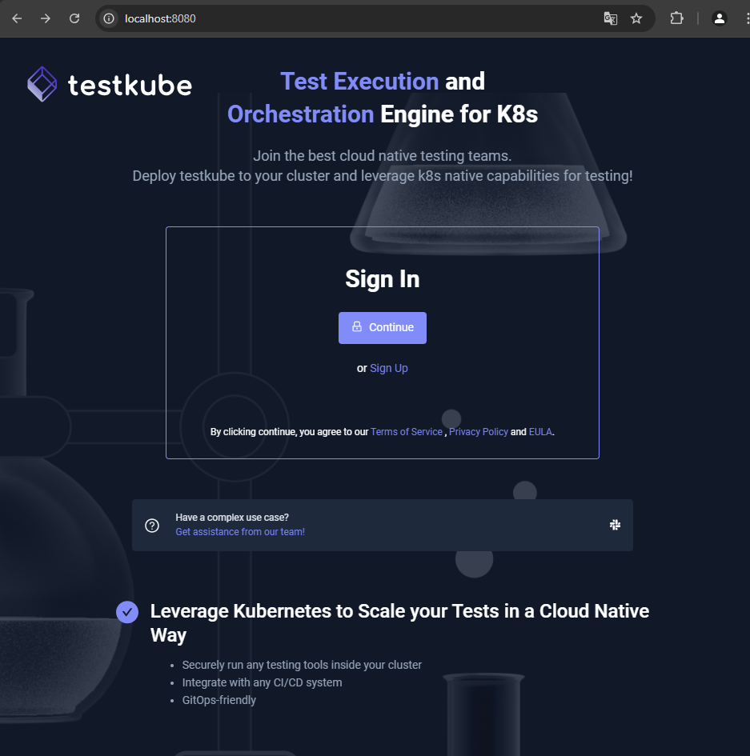
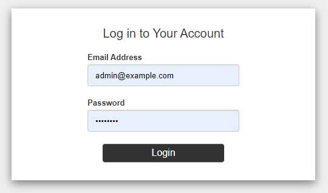
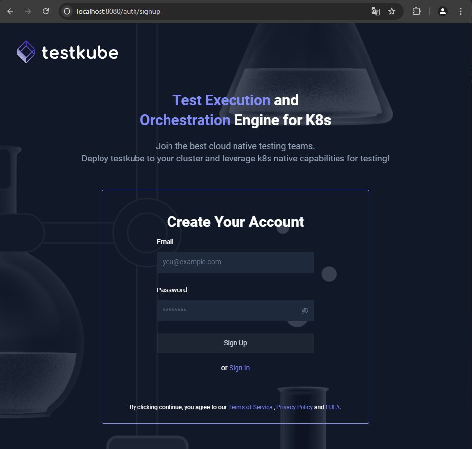
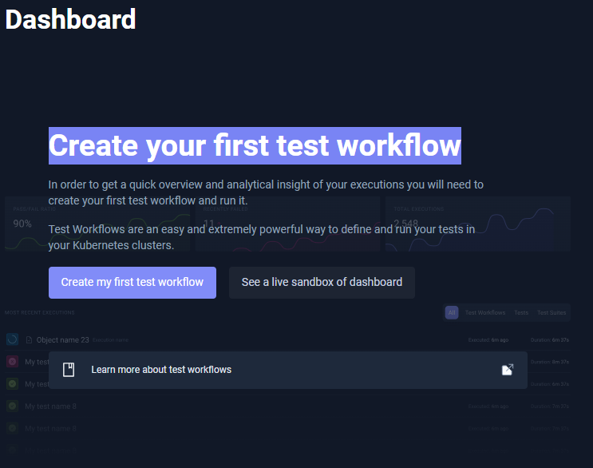
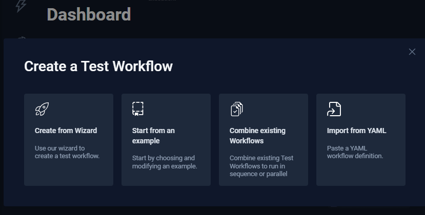

# TESTKUBE

## Dashboard

[Acessando o Testkube local via Browser](http://localhost:8080/)

O administrador nesta demonstração tem o seguinte e-mail e senha: 

> admin@example.com/password

## Login

## Criando conta

## Configurando o primeiro Workflow

## Criando o Workflow de Teste

## Criando o teste

## Configurando a ferramenta que será utilizada no teste

- Name: test.k6.io
- Labels: testkube.io/name:k6
- Template: k6
- K6 Version

Conforme a imagem abaixo:

## Criando a configuração que será utilizada no test

- [Git](../docs/git.md), utilizando um repositório com o script de teste.
- [File](../docs/file.md), indicando o arquivo com o script de teste.
- [String](../docs/string.md), com o script de teste.

Próximos passos... [Verificando consumo CPU/Memória dos Nodes e Pods](../prometheus-grafana-k8s/instalação.md)
