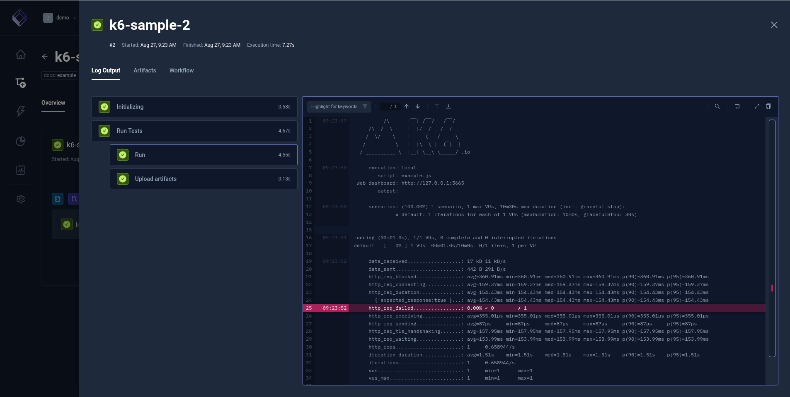

# GIT

## Criando um teste utilizando o GITHUB.

Dessa forma só precisará mexer no repositório do teste.

A configuração do Testetube não precisa ser alterada, só executará o teste.

## Configurando o Testkube com as informações do GITHUB

## Definindo o comando de execução do script

## Conteúdo do Summary, o que será excutado. Im portante conferir

## Teste executado com sucesso !!!

## Verificando o resultado do teste

## Dashboard com os testes que foram executados

## Alterando o WORKFLOWS

Alterar o Content, inserindo mais VUs, aumentando o tempo de execução

## Executando novamente o teste

## Verificando o resultado depois da modificação

