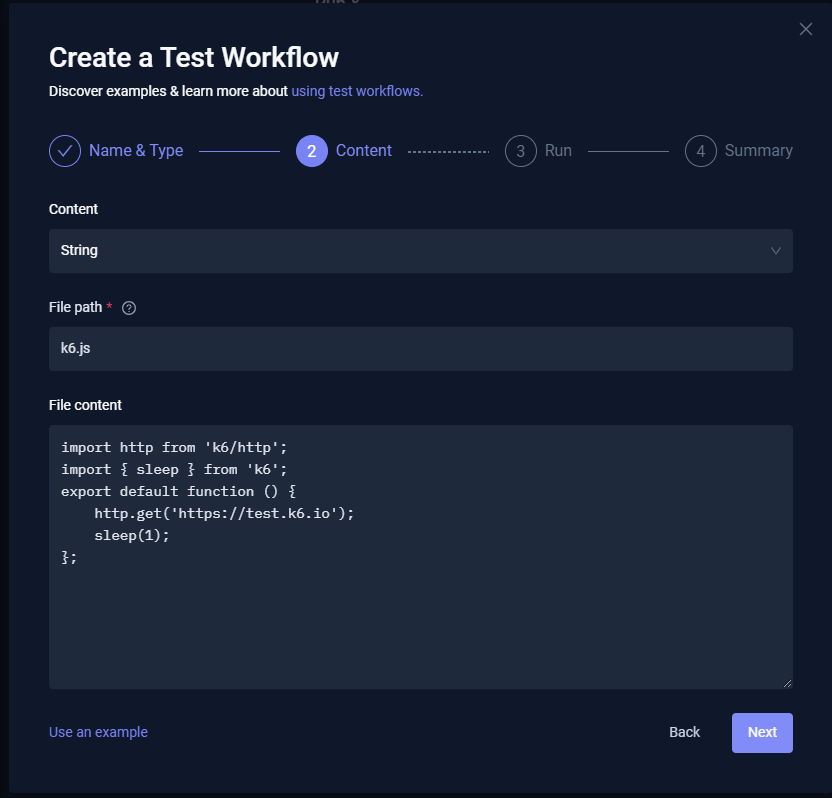

# STRING

Utilizando um script simples

o testkube chama por k6.js

<div align="center">



</div>

## Executando o teste

<div align="center">


</div>


## Verificando o resultado do teste
<div align="center">


</div>


## Verificando a execução do teste

<div align="center">


</div>

## Alterando o WORKFLOWS

Alterar o Content, inserindo mais VUs, aumentando o tempo de execução


<div align="center">


</div>


```bash
kind: TestWorkflow
apiVersion: testworkflows.testkube.io/v1
metadata:
  name: k6-sample
  namespace: testkube
  labels:
    docs: example
spec:
  content:
    files:
    - path: /data/example.js
      content: |-
        import http from 'k6/http';
        import { sleep } from 'k6';
        export const options = {
          vus: 10,
          duration: '60s',
        };
        export default function () {
          http.get('http://test.k6.io');
          sleep(1);
        }
  steps:
  - name: Run Tests
    workingDir: /data
    run:
      image: grafana/k6:0.49.0
      env:
      - name: K6_WEB_DASHBOARD
        value: "true"
      - name: K6_WEB_DASHBOARD_EXPORT
        value: k6-test-report.html
      args:
      - run
      - example.js
    artifacts:
      paths:
      - k6-test-report.html
```

## Executando novamente o teste

<div align="center">


</div>

## Verificando o resultado depois da modificação

<div align="center">


</div>
